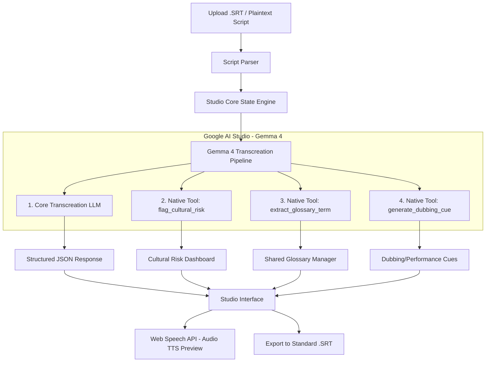

# TransCreate Gemma - Cultural AI Adapter for Indie Filmmakers

> **"Your script. Every culture. Zero compromise."**
>
> Live Demo: **[transcreate-gemma.vercel.app](https://transcreate-gemma.vercel.app/)**
> 
> *Built for the Build with Gemma 4 - AI Durg Hackathon 2026*

---

## Table of Contents
* [The Problem](#the-problem)
* [The Solution](#the-solution)
* [Track 3: Open Track Staged Evaluation](#track-3-open-track-staged-evaluation)
* [Technology Stack](#technology-stack)
* [System Architecture](#system-architecture)
* [Google DeepMind Gemma 4 Integration](#google-deepmind-gemma-4-integration)
  * [1. Transcreation Core Pipeline](#1-transcreation-core-pipeline)
  * [2. Native Function Calling & Tools](#2-native-function-calling--tools)
* [Getting Started & Local Setup](#getting-started--local-setup)
* [Supported Cultures & Languages](#supported-cultures--languages)
* [Sample Translation Comparison](#sample-translation-comparison)
* [Hackathon Tracks & Submission Details](#hackathon-tracks--submission-details)

---

## The Problem

Indie filmmakers and video creators want to release their work globally, but professional dubbing, subtitle translation, and cultural adaptation cost thousands of dollars per minute of footage. 

Standard AI translation tools fail because they translate word-for-word (literally). This:
* Destroys the emotional intensity of dialogue.
* Ruins jokes, sarcasm, and local slang.
* Risks rendering cultural references incomprehensible, or worse, offensive.
* Fails to provide performance directions, leaving voice actors clueless about speed, stress words, and cadence.

---

## The Solution

TransCreate is a next-generation web-based Cultural Adaptation & Subtitle Studio (Transcreation) designed specifically for indie filmmakers. Powered by Google DeepMind Gemma 4, it localizes every line of dialogue to feel completely native to the target culture.

### Key Features:
* **Contextual Transcreation**: Adapts regional slang, humor, and expressions into natural target equivalents.
* **Cultural Risk Dashboard**: Auto-flags high-risk idioms and sensitive words.
* **Director Performance HUD**: Generates custom voice actor cues, speed indicators, and stress words.
* **Instant TTS Playback**: Native browser Text-to-Speech preview to verify correct pronunciation and cadence.
* **SRT Ingestion & Export**: Full support for subtitle parsing, editing, and professional export.

---

## Track 3: Open Track Staged Evaluation

TransCreate fits perfectly into **Track 3: Open Track**, as it leverages Gemma 4 as the core engine to solve a unique domain (Indie Film localization) not strictly bound to voice-first real-time audio chat. We structured our development following a staged proof framework:

* **Stage 1 - Core Proof** (Hindi to/from English US/UK)
  * Fully supports Hindi to/from English transcreation. Tested on dialogue with deep colloquial expressions like "jugaad", "dhamaal", and "apna time aayega".
* **Stage 2 - Range** (Bengali to/from English, Tamil to/from English)
  * Demonstrates range by integrating Bengali to/from English and Tamil to/from English within the same prompt and function pipeline, proving the localization logic isn't hand-tuned to just one dialect.
* **Stage 3 - Vision (20-Language scaling roadmap)**
  * The codebase includes pre-configured mappings and metadata parameters for 20 distinct regional and international cultures, ready for production-level global scaling.

---

## Technology Stack

* **Frontend framework**: React 19 + Vite 8 + TypeScript 6
* **UI Styling**: Vanilla CSS with cinematic Design Tokens (dark theater theme with vibrant neon highlights)
* **AI Engine**: Google DeepMind Gemma 4 (gemma-4-27b-it) via Google AI Studio API
* **Function Calling**: Native tool calling schemas for risk analysis, glossaries, and cues
* **Speech Playback**: Web Speech API (SpeechSynthesis) for zero-latency local audio previewing
* **Hosting**: Vercel

---

## System Architecture



---

## Google DeepMind Gemma 4 Integration

### 1. Transcreation Core Pipeline
Every line of the subtitle file is processed in parallel (using a concurrent worker queue) alongside a sliding context window of the 2 preceding lines. This ensures Gemma 4 understands who is speaking to whom and retains dialogue flow:

```typescript
// System instruction for contextual transcreation
const prompt = `Adapt the dialogue line for a ${targetCulture} audience.
Do NOT translate literally — translate the EMOTIONAL INTENT. 
Replace idioms, slang, humor, and cultural references with native equivalents.
Match speaking length so it fits the original timing.

SOURCE CULTURE: ${sourceCulture}
TARGET CULTURE: ${targetCulture}
CONTEXT (preceding lines): ${context}
LINE TO TRANSCREATE: "${line.text}"`
```

### 2. Native Function Calling & Tools
To extract metadata without polluting the translation text, Gemma 4 is configured with native tools:

* **`flag_cultural_risk`**:
  * *Parameters*: `risk` (`critical` | `caution` | `safe`), `reason`, `flagged_terms`.
  * *Purpose*: Auto-highlights volatile phrases that might fail or offend in target territories.
* **`extract_glossary_term`**:
  * *Parameters*: `original_term`, `meaning`, `adaptations` (custom culture arrays).
  * *Purpose*: Builds a persistent cultural dictionary to guarantee term consistency.
* **`generate_dubbing_cue`**:
  * *Parameters*: `emotion`, `pace` (`slow` | `normal` | `fast`), `stress_words`, `director_note`.
  * *Purpose*: Produces actionable acting cues for the recording booth.

---

## Getting Started & Local Setup

### 1. Clone & Install
```bash
git clone https://github.com/DeepSaha25/TransCreate-Gemma.git
cd TransCreate-Gemma
npm install
```

### 2. Configure Environment variables
Create a `.env` file in the root folder:
```env
VITE_GEMINI_API_KEY=your_google_ai_studio_api_key
VITE_GEMMA_MODEL=gemma-4-27b-it
```
> Get a free API key at [aistudio.google.com](https://aistudio.google.com/apikey). No credit card required!
>
> **Demo Mode**: If no key is configured, the application automatically runs in Demo Mode using cached realistic responses so you can test all features immediately!

### 3. Run Dev Server
```bash
npm run dev
```
Open **[http://localhost:5173](http://localhost:5173)** in your browser!

---

## Supported Cultures & Languages

The studio is designed for global reach with 20 preset culture profiles:

* **South Asia**: Hindi (India), Bengali (India/Bangladesh), Marathi (India), Tamil (India), Telugu (India)
* **English-speaking**: English (US), English (UK), English (Australia)
* **Latin America & Europe**: Spanish (Mexico), Portuguese (Brazil), Spanish (Spain), French, German, Italian
* **East Asia**: Japanese, Korean, Chinese (Simplified)
* **Other regions**: Arabic (Egypt), Russian, Turkish

---

## Sample Translation Comparison

| Source Line (Hindi) | Literal Translation | TransCreate Adaptation (en-US) | Emotion & Director Rationale |
| :--- | :--- | :--- | :--- |
| `"Bhai, yeh toh bahut bada jugaad hai!"` | `"Brother, this is a very big hack!"` | `"Dude, this is some major MacGyvering!"` | **Excited**<br>💡 *'Jugaad' implies a clever improvised solution — 'MacGyvering' captures that exact slang energy for an American audience.* |
| `"Apna time aayega"` | `"Our time will come"` | `"Our day in the sun is coming!"` | **Optimistic**<br>💡 *Adapts the street anthem phrase to a well-known English idiom representing rising success.* |

---

## Hackathon Tracks & Submission Details

* **Kaggle Writeup**: Available in the repository as [kaggle_writeup.md](file:///C:/Users/Deep%20Saha/.gemini/antigravity-ide/brain/94eadb09-bfed-4a39-ab7c-5f9791e860a7/kaggle_writeup.md).
* **Live App**: Hosted on Vercel at **[transcreate-gemma.vercel.app](https://transcreate-gemma.vercel.app/)**.
* **Source Code**: Fully public Git repository.

---

*Created by Deep Saha for the Build with Gemma 4 Hackathon 2026.*
